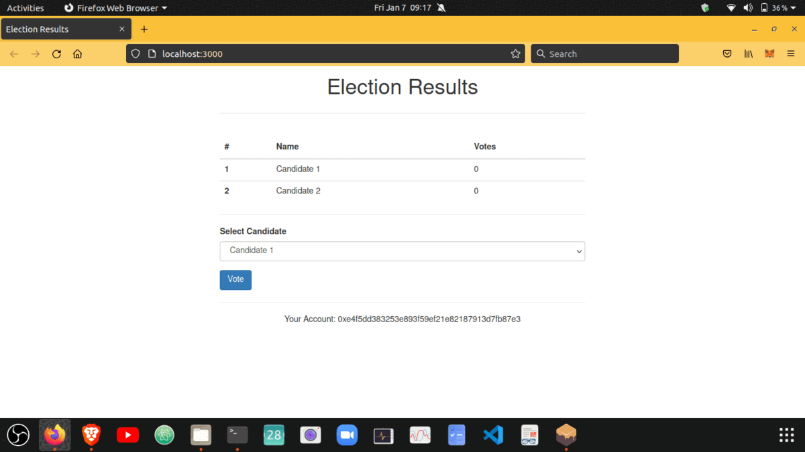

# Decentralised Election App / Decentralised Voting App: 

- Even though a decentralised voting app cannot be used to make money, but it can provide 
anonymity to the voters who take part in election. `Hence it can save Democracy`. 
- Since a blockchain is a permanent record of transactions (votes) that are distributed, every vote can irrefutably be traced back to exactly when and where it happened without revealing the voter’s identity. 
- In addition, past votes cannot be changed, while the present can’t be hacked, because every transaction is verified by every single node in the network. And any outside or inside attacker must have control of 51% of the nodes to alter the record.
- Even if the attacker was able to achieve that while incorrectly entering user votes with their real IDs under the radar, end to end voting systems could allow voters to verify whether their vote was correctly entered in the system, making the system extremely safe.

### what are the main issues decentralised voting app solves? 
Transparency, Security, Accessibility, Audibility which affect the democratic system today.

### what is a smart contract?

A contract is just like a class in Solidity which consists (its functions) and data (its state) that resides at a specific address on the Ethereum Blockchain. In each Contract, we can define State Variables, Methods, and Events, etc. A smart contract runs exactly as programmed without any possibility of downtime, censorship, fraud, and third-party interference.

### voting smart contract created in Remix:

## Election DAPP Version-1.0:

Made a decentralised election app which can be used to conduct elections through mobile or web app. This is just a basic version 1.0.

### Basic overview of the project structure of election dapp version-1.0 :

- `[/election-v1.0/contracts/election.sol]` : This is were the election smart contract's logic is written.
- `[/election-v1.0/contracts/migration.sol]` : This will handle all of our migration whenever we deploy our smart contracts to the blockchain.
- `[/election-v1.0/migrations]` : This is were all the migration files live whenever we deploy our smart contracts to the blockchain. In this, we are changing its state.This same as changing the state of the database.
- `[/election-v1.0/node_modules]` : This is were all our node dependecies live.
- `[/election-v1.0/src]` : Source directory. This is were we develop our client-side app.
- `[/election-v1.0/test]` : Test files are kept here.
- `[/election-v1.0/package.json]` : This is were we specify our depedencies.
- `[/election-v1.0/truffle-config.js]` : Main conf file for our project.

## Dependencies

- NPM:

```
  
  > nvm use 16.13.0
  > npm install
  > npm run dev
```

- Truffle:

```
  > npm install --g truffle@5.1.39
  > truffle init
  > truffle compile
  > truffle migrate
```

- Ganache: Local Blockchain Network
- Metamask

## Step 1. Install dependencies:

```
> cd election-v1.0
> npm install
```

## Step 2. Start Ganache

Open the `Ganache GUI client` that you downloaded and installed Or use `ganache-cli` .This will start your local blockchain instance.

## Step 3. Compile & Deploy Election Smart Contract:

`> truffle compile`
You must compile election smart contract before migrating it.
`> truffle migrate --reset`
You must migrate the election smart contract each time your restart ganache.
`>truffle test` : 
Here smart contract is tested whether it workes according to our desire.

To see the logs: `[test/truffle-logs.txt]`

## Step 4. Configure Metamask:

- Unlock Metamask
- Connect metamask to your local Etherum blockchain provided by Ganache.
- Import an account provided by ganache.

## Step 5. Run the Front End Application:

`$ npm run dev`
Visit this URL in your browser: http://localhost:3000

## Output of election dapp version 1.0:



